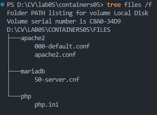
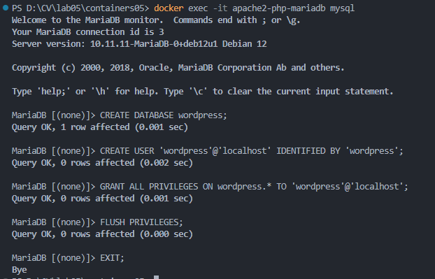
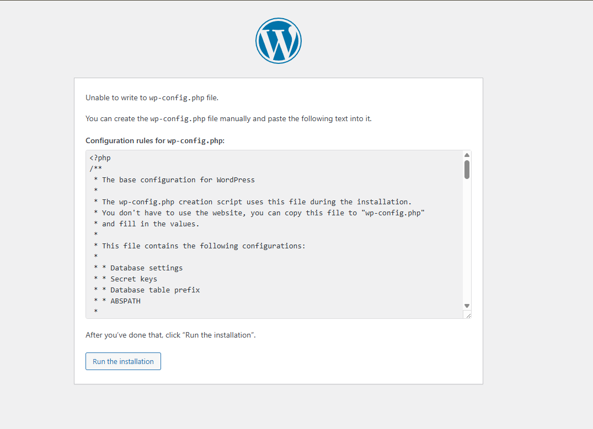
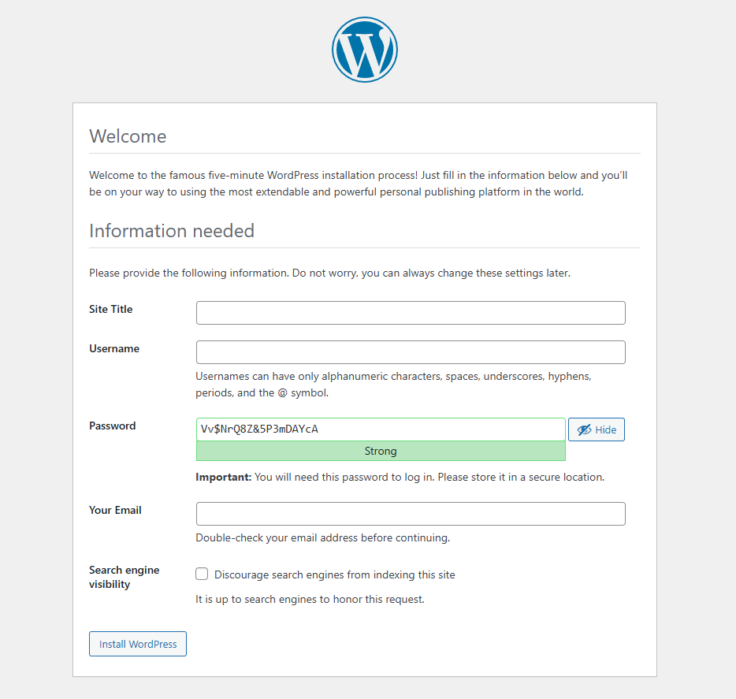

# Darea de seamă  
**Lucrarea de laborator nr. 5: Rularea site-ului într-un container**

---

## **Scopul lucrării**  
După executarea acestei lucrări de laborator, studentul va fi capabil să pregătească un container pentru a rula un site web bazat pe Apache HTTP Server + PHP (mod_php) + MariaDB.

---

## **Sarcina**  
- Creați un fișier `Dockerfile` pentru a construi o imagine a containerului care va conține un site web bazat pe Apache HTTP Server + PHP (mod_php) + MariaDB.  
- Configurați stocarea bazei de date MariaDB într-un volum montat.  
- Configurați serverul astfel încât să fie disponibil pe portul **8000**.  
- Instalați site-ul WordPress și verificați funcționarea acestuia.

---

## **Descrierea executării lucrării**


### **1. Crearea structurii proiectului și configurarea fișierelor necesare**
1. Am creat folderul `containers05` și în el folderele `files/apache2`, `files/php`, `files/mariadb` și `files/supervisor`  
   ```bash
   mkdir contaainers05
   cd containers04
   mkdir -p files/apache2 files/php files/mariadb files/supervisor
   ```

2. Am adăugat fișierul `Dockerfile` cu următorul conținut inițial:  
   ```dockerfile
   FROM debian:latest

   RUN apt-get update && \
       apt-get install -y apache2 php libapache2-mod-php php-mysql mariadb-server && \
       apt-get clean
   ```
3. Am construit imaginea containerului și creat containerul:  
   ```bash
   docker build -t apache2-php-mariadb .
   docker run -d --name apache2-php-mariadb apache2-php-mariadb
   ```

4. Am extras fișierele de configurare:
   ```bash
   docker cp apache2-php-mariadb:/etc/apache2/sites-available/000-default.conf files/apache2/
   docker cp apache2-php-mariadb:/etc/apache2/apache2.conf files/apache2/
   docker cp apache2-php-mariadb:/etc/php/8.2/apache2/php.ini files/php/
   docker cp apache2-php-mariadb:/etc/mysql/mariadb.conf.d/50-server.cnf files/mariadb/
   ```

5. Am verificat dacă fișierele se află în locațiile corespunzătoare:
   ```bash
   tree files /a
   ```
   

6. Am oprit și am șters containerul:  
   ```bash
   docker stop apache2-php-mariadb
   docker rm apache2-php-mariadb
   ```

---

### **2. Configurarea fișierelor**

#### **a. Fișierele de configurare `apache2`**
- În fișierul `files/apache2/000-default.conf`:  
  - Am înlocuit `#ServerName www.example.com` cu:  
    ```
    ServerName localhost
    ```
  - Am înlocuit `ServerAdmin webmaster@localhost` cu e-mailul dvs. (e.g., `StudentEmail@gmail.com`).  
  - După `DocumentRoot /var/www/html` am adăugat:  
    ```
    DirectoryIndex index.php index.html
    ```
- În fișierul `files/apache2/apache2.conf`, am adăugat la sfârșit:  
  ```
  ServerName localhost
  ```

#### **b. Fișierele de configurare `php`**
- În fișierul `files/php/php.ini`:  
  - Am înlocuit linia `;error_log = php_errors.log` cu:  
    ```
    error_log = /var/log/php_errors.log
    ```
  - Am configurat parametrii:  
    ```
    memory_limit = 128M
    upload_max_filesize = 128M
    post_max_size = 128M
    max_execution_time = 120
    ```

#### **c. Fișierele de configurare `MariaDB`**
- În fișierul `files/mariadb/50-server.cnf`:  
  - Am eliminat simbolul `#` din linia:  
    ```
    log_error = /var/log/mysql/error.log
    ```

---

### **3. Crearea scriptului de pornire Supervisorului**
- Am adăugat fișierul(și am creat folderul necesar) `files/supervisor/supervisord.conf` cu următorul conținut:  
  ```ini
  [supervisord]
  nodaemon=true
  logfile=/dev/null
  user=root

  # apache2
  [program:apache2]
  command=/usr/sbin/apache2ctl -D FOREGROUND
  autostart=true
  autorestart=true
  startretries=3
  stderr_logfile=/proc/self/fd/2
  user=root

  # mariadb
  [program:mariadb]
  command=/usr/sbin/mariadbd --user=mysql
  autostart=true
  autorestart=true
  startretries=3
  stderr_logfile=/proc/self/fd/2
  user=mysql
  ```

---

### **6. Finalizarea fișierului `Dockerfile`**
Am adăugat următoarele linii:
- Montarea volumelor:
  ```dockerfile
  VOLUME /var/lib/mysql
  VOLUME /var/log
  ```
- Instalarea Supervisorului și gestionarea fișierelor WordPress:  
  ```dockerfile
  RUN apt-get update && \
    apt-get install -y ... supervisor curl && \
    apt-get clean

  # RUN nu dezarhivează arhivele descărcate. Descărcam cu curl si dezărhivam
  RUN curl -fsSL https://wordpress.org/latest.tar.gz | tar -xz --strip-components=1
  ```
- Copierea fișierelor de configurare:  
  ```dockerfile
  COPY files/apache2/000-default.conf /etc/apache2/sites-available/000-default.conf
  COPY files/apache2/apache2.conf /etc/apache2/apache2.conf
  COPY files/php/php.ini /etc/php/8.2/apache2/php.ini
  COPY files/mariadb/50-server.cnf /etc/mysql/mariadb.conf.d/50-server.cnf
  COPY files/supervisor/supervisord.conf /etc/supervisor/supervisord.conf
  ```


---

### **6. Crearea și pornirea containerului**
- Construiți imaginea containerului:
   ```bash
   docker build -t apache2-php-mariadb .
   ```
- Porniți containerul:
   ```bash
   docker run -d -p 8000:80 --name apache2-php-mariadb apache2-php-mariadb 
   ```
- Verific dacă site-ul sa pornit la:  
  - `http://localhost:8000/`

- Verific dacă în `/var/www/html` există fișierele wordpress:
    ```bash
    docker exec -it apache2-php-mariadb ls -l
    ```
- Verific dacă fișierele de configurare apache2, php, mariadb sunt modificateȘ
    ```bash
    docker exec -it apache2-php-mariadb cat /etc/apache2/sites-available/000-default.conf
    docker exec -it apache2-php-mariadb cat /etc/apache2/apache2.conf
    docker exec -it apache2-php-mariadb cat /etc/php/8.2/apache2/php.ini
    docker exec -it apache2-php-mariadb cat /etc/mysql/mariadb.conf.d/50-server.cnf
    ```
 
---

### **7. Crearea bazei de date și configurarea WordPress**
- Mă conectez la MariaDB și creați baza de date:  
  ```bash
  docker exec -it apache2-php-mariadb mysql
  CREATE DATABASE wordpress;
  CREATE USER 'wordpress'@'localhost' IDENTIFIED BY 'wordpress';
  GRANT ALL PRIVILEGES ON wordpress.* TO 'wordpress'@'localhost';
  FLUSH PRIVILEGES;
  EXIT;
  ```
    


---

### **8. Crearea fișierului de configurare WordPress**
- Am deschis site-ul WordPress la adresa `http://localhost:8000/` și încep configurarea.
- La pasul doi, am dat următoarele valoriȘ
    - Numele bazei de date: wordpress
    - Utilizatorul bazei de date: wordpress
    - Parola bazei de date: wordpress
    - Adresa bazei de date: localhost
    - Prefixul tabelelor: wp_.
- Am copiat conținutul afișat și lam plasat într-un fișier nou  `files/wp-config.php`.
 
- Am adăugat în Dockerfile:  
  ```dockerfile
  COPY files/wp-config.php /var/www/html/wp-config.php
  ```

---

### **9. Finalizare**
- A oprit containerul și l-am șters:
    ```
    docker stop apache2-php-mariadb
    docker rm apache2-php-mariadb
    ```
- Am reconstruit imaginea și am creat containerul:
    ```
    docker build -t apache2-php-mariadb .
    docker run -d -p 8000:80 --name apache2-php-mariadb apache2-php-mariadb
    ```
- Am creat din nou baza de date:
    ```bash
    docker exec -it apache2-php-mariadb mysql
    CREATE DATABASE wordpress;
    CREATE USER 'wordpress'@'localhost' IDENTIFIED BY 'wordpress';
    GRANT ALL PRIVILEGES ON wordpress.* TO 'wordpress'@'localhost';
    FLUSH PRIVILEGES;
    EXIT;
    ```
- Am deschis site-ul la adresa `http://localhost:8000/`:
    

---

## **Întrebări și răspunsuri**

1. **Ce fișiere de configurare au fost modificate?**  
   Fișierele `000-default.conf`, `apache2.conf`, `php.ini`, `50-server.cnf`, și `supervisord.conf`.

2. **Pentru ce este responsabilă instrucțiunea `DirectoryIndex`?**  
   Aceasta setează fișierele pe care serverul le consideră pagini de start atunci când un director este accesat.

3. **De ce este necesar fișierul `wp-config.php`?**  
   Acesta conține detaliile de configurare ale site-ului WordPress, cum ar fi baza de date și acreditivele.

4. **Pentru ce este responsabil parametrul `post_max_size` din fișierul `php.ini`?**  
   Acesta definește dimensiunea maximă permisă pentru datele trimise printr-o cerere POST.

5. **Care sunt deficiențele imaginii create?**  
   - Trei servicii operează în același container.
   - Configurarea și personalizarea manuală a fișierelor.  
   - Lipsa securizării componentelor și configurării avansate.

---

## **Concluzii**
Această lucrare de laborator a demonstrat etapele necesare pentru configurarea unui container Docker capabil să ruleze un site WordPress. Am învățat să creez o imagine personalizată care să includă Apache HTTP Server, PHP și MariaDB. Cu toate acestea, procesul manual poate fi optimizat prin utilizarea altor instrumente, cum ar fi `docker-compose`. Această experiență a contribuit esențial la înțelegerea utilizării containerizării în mediul web.